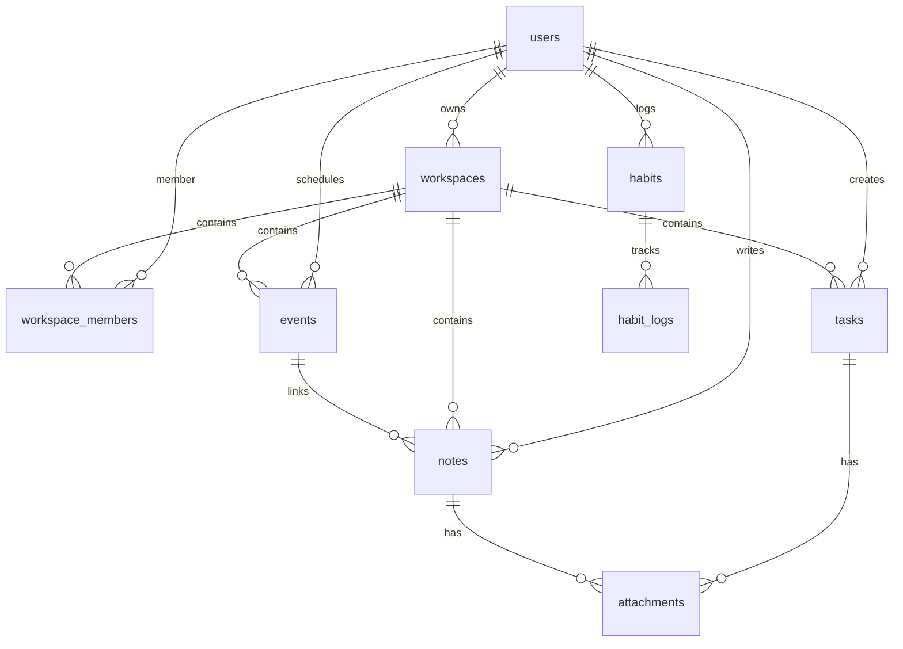

# Mind-Sync — System Architecture

This document outlines the system architecture, technical choices, and design standards implemented in the Mind-Sync productivity workspace.

---

## 🏛️ System Overview

Mind-Sync is structured as a modern serverless web application. It uses Next.js for server-side rendering and API routes, Clerk for user authentication, PostgreSQL for structured persistent data, Redis/Celery for async tasks, and PartyKit for real-time note collaboration via Yjs.

### High-Level Architecture Diagram
```
                     +---------------------------------------+
                     |              User Browser             |
                     +---+-------------------+-----------+---+
                         |                   |           |
             HTTPS / API |     WebSockets    |           | WebSockets (Real-time Notes)
                         v                   |           v
           +-------------+-------------+     |     +-----+-----+
           |    Vercel Serverless      |     |     |  PartyKit |
           |      (Next.js App)        |     |     |   Server  |
           +-----+-------+-------+-----+     |     +-----+-----+
                 |       |       |           |           |
            Auth |       | DB    | Webhook   | Sync      | Yjs Sync
                 v       v       v           v           v
           +-----+---+ +-+-------+-+       +-+-----------+-+
           |  Clerk  | |PostgreSQL |       |  Google API |
           |  Auth   | | (Supabase)|       |  (Calendar) |
           +---------+ +-----------+       +-------------+
                             ^
                             | Async Tasks / AI Summary
                             v
                       +-----+-----+
                       |  Celery   | <---> [ Redis Broker ]
                       |  Workers  |
                       +-----+-----+
                             |
                             v
                       +-----+-----+
                       |  OpenAI   | (Model: gpt-5.4-mini)
                       |    API    |
                       +-----------+
```

---

## 💻 Tech Stack

| Layer | Technology | Purpose |
|---|---|---|
| **Frontend** | React 19, Next.js 16 | Core web framework, Server-Side Rendering (SSR), App Router |
| **Styling** | Tailwind CSS v4, Framer Motion | Fluid layouts, visual animations, transitions |
| **Auth** | Clerk | Multi-tenant user login and session management |
| **Database** | PostgreSQL | Relational database engine |
| **ORM** | Drizzle ORM | Type-safe SQL query generation and database migrations |
| **State** | Zustand | Multi-slice client state management |
| **Collab** | PartyKit, Yjs | Real-time collaborative split-pane note-taking |
| **AI Layer** | OpenAI (gpt-5.4-mini) | Meeting summaries and AI-based smart scheduling |
| **Testing** | Vitest, Playwright | Unit/integration testing and End-to-End browser validation |
| **DevOps** | Sentry, Vercel | Monitoring, tracking, and edge hosting |

---

## 🗄️ Database Schema

Database entities are defined in `src/db/schema.ts` using Drizzle ORM pg-core primitives.



### Key Tables
1. **`users`**
   - Stores user state referenced by Clerk user IDs.
   - Credentials, Google OAuth refresh tokens, and user preferences (`theme`, etc.).
2. **`workspaces` / `workspace_members`**
   - Facilitates multi-tenancy. Workspace roles default to `viewer`, `editor`, or `admin`.
3. **`tasks`**
   - Stores user tasks with properties: `status` (Todo, InProgress, Done), `priority` (P0 to P3), `due_date`, and `recurrence` rules.
   - Parent/child relations support nested subtasks, while `depends_on` defines blocking dependencies.
4. **`events`**
   - Integrates local calendar events with external identifiers (Google Calendar sync).
5. **`notes`**
   - Rich-text editor documents (saved as Tiptap JSON).
   - Stores AI summaries, transcriptions, decisions, and sentiments generated from audio/meeting modes.
6. **`habits` / `habit_logs`**
   - Tracks behavioral habits, streaks (current & longest), target counts, and daily completions.

---

## 🧠 State Management

Client state is managed by a single Zustand store slice model defined in `src/store/useStore.ts` and `src/store/slices/`. 

State is divided into domain slices:
- **`appSlice`**: General UI state, sidebars, modal triggers, and toast notifications.
- **`eventSlice`**: Core calendar events cache, Google calendar synchronization queues.
- **`kanbanSlice`**: Board visual state, column arrangements, drag-and-drop actions.
- **`noteSlice`**: Active document reference, edit lock state, and revision history.
- **`taskSlice`**: Task repository, filters, recursive subtask calculations, and dependencies.
- **`timerSlice`**: Focus timer control, pomodoro countdown, and ambient sound options.

---

## 🤖 AI Integration Layer

All AI functions are executed via Server Actions (`src/actions/ai.ts`) and use the central client configured in `src/lib/openai.ts`.

### Engineering Features
- **Prompt Injection Protection**: Transcripts are automatically sanitized (removing block markdown codes and stripping dangerous delimiters) and length-capped before inference.
- **Robust Schema Parsing**: Prompts instruct models to output raw JSON arrays. The system parses responses, falls back to raw text if parsing fails, and handles database synchronization.
- **Distributed Rate Limiting**: Distributed rate-limiting blocks usage at the API route level (10 requests/min for summary, 5 requests/min for scheduling) using `rateLimits` table tokens.
- **Offline / Mock Fallback**: If `OPENAI_API_KEY` is not configured, the app gracefully falls back to mock responses with simulated latency, allowing offline developer builds to remain functional.

---

## 🧪 Testing & Validation

Mind-Sync follows rigorous testing standards:
1. **Unit & Integration Testing (Vitest)**:
   - Configured in `vitest.config.ts` and initialized with `src/test/setup.ts`.
   - Validates utility functions, server action logic, and Zustand state calculations.
2. **End-to-End (E2E) Browser Tests (Playwright)**:
   - Configured in `playwright.config.ts`.
   - Evaluates page navigation, flow logic, and drag-and-drop features (`e2e/landing.spec.ts` and `e2e/app.spec.ts`).
